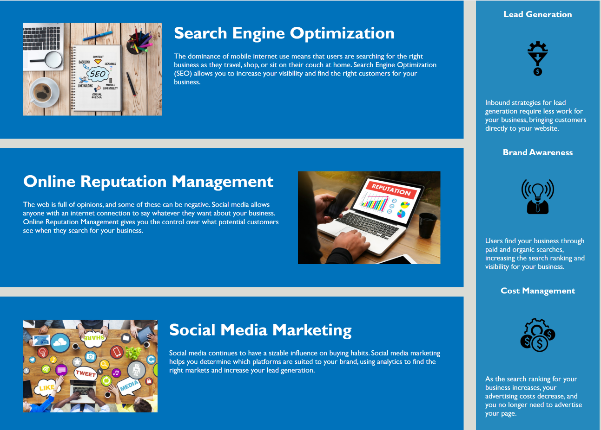

# Homework W1 - HTML, CSS, Git: Code Refactor
This is a web page made in Html and CSS. It comprises the first Homework Assignment in our Coding Bootcamp.

## Contents

The app is composed of 2 pages, index.html and style.css. It also has several images in the img folder.

## User Story

A user needs a codebase that follows accessibility standards so that the site is optimized for search engines.
This includes the use of semantic HTML elements in a logical structure and sequential order, as well as alt attributes for images and a suitable title element.

## Built With

* [VScode](https://code.visualstudio.com/) - The editor of choice

#### Initial interface

#### Further Improvements

The original images have been resized for performance improvements.

A favicon had been added.

#### ToDo
Make page responsive for different devices. 

### Licence

GNU General Public License v3.0

### Link to the App
<a href="https://github.com/galluk/Homework_Week_1_LG/blob/master/index.html">My Week 1 Homework</a>

## Authors

* **Luke Gallagher** - 
luke.gallagher.cst@gmail.com

## Acknowledgments

* To Klaus, Sandes and Moz - thanks for the first couple of weeks! 
